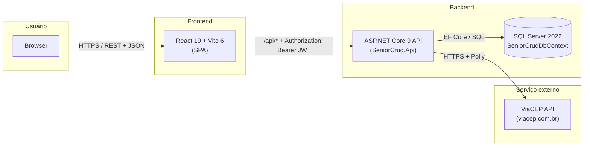
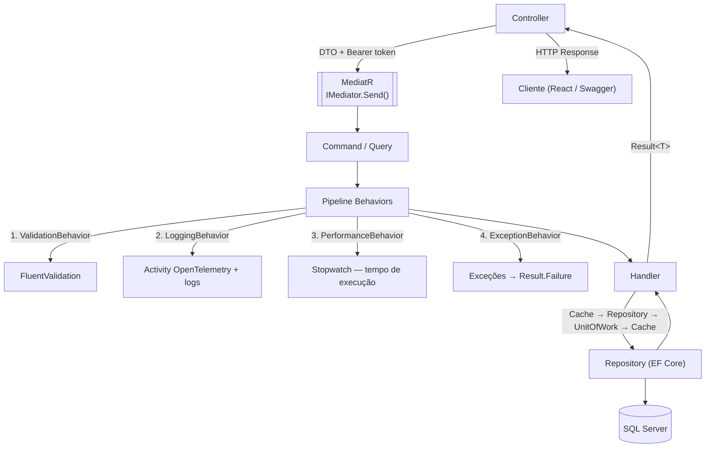
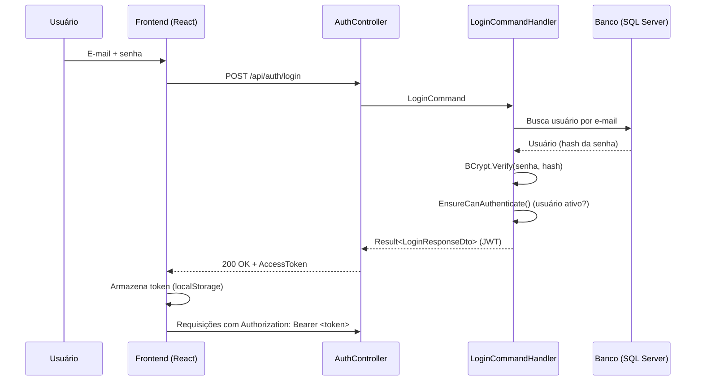
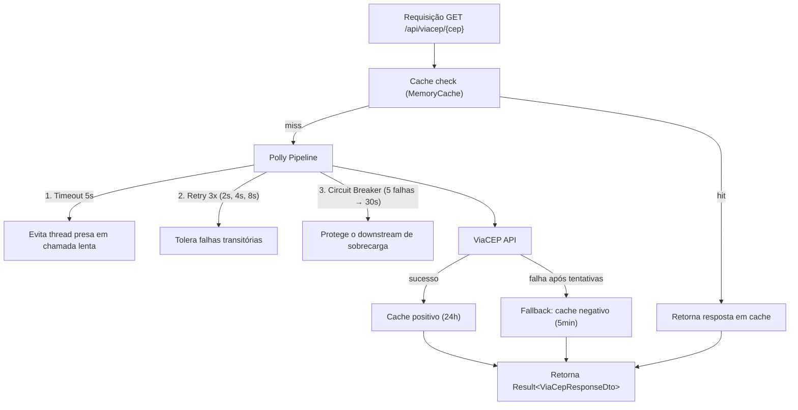
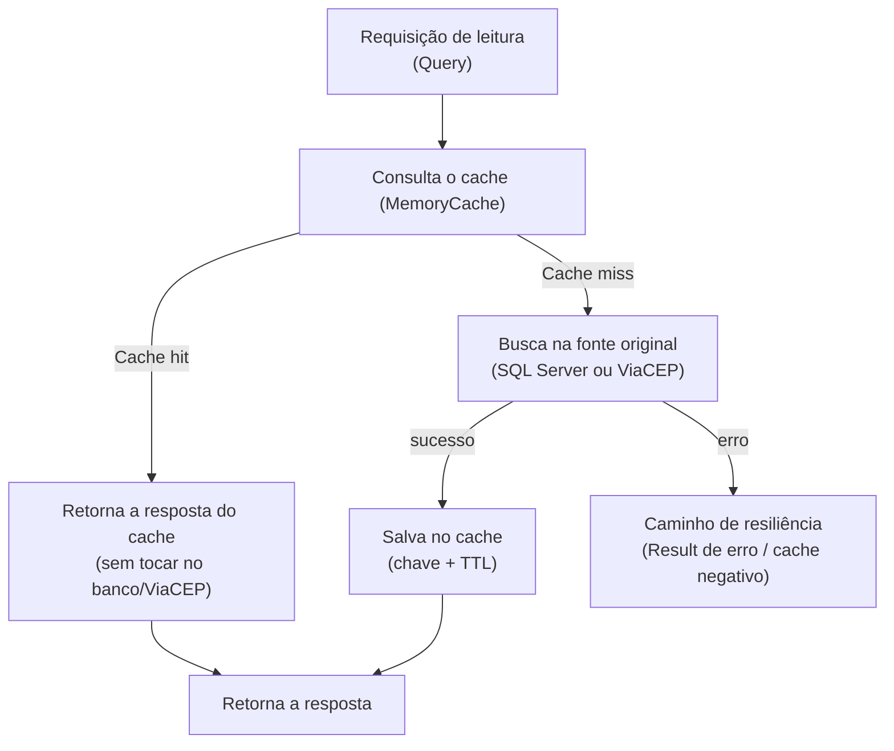

# SeniorCRUD

**API REST corporativa para gerenciamento de usuários e endereços**

<p align="center">
  
  
  
  
  
  
  
  
</p>

---

## Sobre o Projeto

SeniorCRUD é uma aplicação full stack (.NET 9 + React 19) para gerenciamento de usuários e endereços, desenvolvida como teste técnico. Combina backend ASP.NET Core com SPA em React, cobrindo autenticação JWT, integração ViaCEP com resiliência, cache, exportação CSV, observabilidade e dashboard executivo — com foco em demonstrar maturidade em arquitetura, segurança, resiliência e qualidade de código.

---

## Índice

- [Sobre o Projeto](#sobre-o-projeto)
- [Objetivos do Teste](#objetivos-do-teste)
- [Arquitetura](#arquitetura)
- [Estrutura da Solução](#estrutura-da-solução)
- [Decisões Técnicas](#decisões-técnicas)
- [Bibliotecas Utilizadas](#bibliotecas-utilizadas)
- [Segurança](#segurança)
- [Resiliência](#resiliência)
- [Observabilidade](#observabilidade)
- [Frontend](#frontend)
- [Funcionalidades Implementadas](#funcionalidades-implementadas)
- [Cache](#cache)
- [Testes](#testes)
- [Como Executar](#como-executar)
- [Melhorias para Produção](#melhorias-para-produção)
- [Escalabilidade](#escalabilidade)
- [Desafios Encontrados](#desafios-encontrados)
- [Qualidade](#qualidade)

---

## Objetivos do Teste

### Requisitos do Desafio

| Requisito | Tipo | Status |
|-----------|------|--------|
| Login com autenticação JWT | Funcional | ✅ |
| CRUD de Usuários | Funcional | ✅ |
| CRUD de Endereços | Funcional | ✅ |
| Integração ViaCEP | Funcional | ✅ |
| Exportação CSV | Funcional | ✅ |
| JWT (JSON Web Token) | Técnico | ✅ |
| Swagger / OpenAPI | Técnico | ✅ |
| Logs estruturados (Serilog) | Técnico | ✅ |
| Paginação, ordenação e filtros | Técnico | ✅ |
| Cache ViaCEP | Técnico | ✅ |
| Timeout, Retry e Fallback (Polly) | Técnico | ✅ |
| Health Checks (SQL Server, ViaCEP, MemoryCache) | Técnico | ✅ |
| C# + SQL Server | Técnico | ✅ |
| Clean Architecture, CQRS, FluentValidation | Diferencial | ✅ |
| Rate Limiting | Diferencial | ⏳ melhoria futura |
| Versionamento de API | Diferencial | ⏳ melhoria futura |

---

## Arquitetura

### Arquitetura Física (Visão de Implantação)



O Browser consome apenas a SPA estática; a SPA consome exclusivamente a API via REST/JSON autenticado com JWT; a API acessa o SQL Server via EF Core e consulta o ViaCEP com políticas de resiliência (Polly).

### Clean Architecture

O projeto é estruturado em **cinco projetos** concêntricos com dependências apontando para dentro — o domínio não conhece a aplicação, que não conhece a infraestrutura, que não conhece a API (layout e responsabilidades em [Estrutura da Solução](#estrutura-da-solução)).

**Problema que resolve:** camadas acopladas espalham regras de negócio pelo código (validações no controller, queries no repositório) e qualquer troca de tecnologia gera efeito dominó de alterações. A Clean Architecture inverte o fluxo: o **domínio** é o centro estável e as tecnologias orbitam ao seu redor.

**Benefícios:**
- **Testabilidade:** cada camada é testada isoladamente — o domínio não depende de banco, a aplicação não depende de HTTP
- **Troca de tecnologias:** substituir EF Core por Dapper, SQL Server por PostgreSQL ou MemoryCache por Redis afeta apenas Persistência/Infraestrutura
- **Isolamento do domínio:** regras de negócio puras, sem frameworks nem concerns de infraestrutura
- **Paralelismo:** responsabilidade clara por camada, facilitando times paralelos

**Desvantagens (reconhecidas):** mais projetos e indireção (Controller → Command → Handler → Repository) e curva de aprendizado maior — custo amortizado pelo ganho de manutenibilidade a partir de poucos casos de uso, e pela exigência do desafio de demonstrar maturidade arquitetural.

### CQRS (Command Query Responsibility Segregation)

Comandos (escrita) e consultas (leitura) são separados em objetos distintos: **Commands** (`CreateUserCommand`, `UpdateAddressCommand`, `DeleteUserCommand`, `LoginCommand`), **Queries** (`GetUsersQuery`, `GetAddressByCepQuery`) e um **handler** dedicado para cada um.

**Problema que resolve:** em CRUD tradicional, o mesmo serviço acumula lógica de escrita e de leitura — consultas acabam "pagando" pela complexidade das escritas (e vice-versa). O CQRS separa os dois caminhos para que cada um evolua de forma independente.

**Benefícios:**
- **Separação de concerns:** escritas focam em validação e consistência; leituras otimizam projeções e cache
- **Cache versionado:** leitura/escrita separadas permitem invalidar o cache apenas nas mutações
- **Pipeline behaviors:** o MediatR intercepta todos os commands/queries (validação, logging, performance) sem poluir os handlers

**Fluxo de uma requisição:**



- **Controller fino:** mapeia o DTO para Command/Query e delega ao MediatR — nunca contém regras de negócio

**CQRS vs CRUD Tradicional:**

| Aspecto | CQRS | CRUD Tradicional |
|---------|------|------------------|
| **Complexidade** | Maior (commands, queries, handlers) | Menor (service único) |
| **Separação** | Leitura e escrita independentes | Acopladas |
| **Cache** | Fácil de invalidar por tipo de operação | Misturado |
| **Pipeline** | Behaviors transversais | Difícil de implementar |

**Justificativa:** adota-se CQRS **in-process** (sem separação física de bancos de leitura/escrita) — entrega os benefícios de organização e pipeline sem o custo operacional de um CQRS distribuído; combinado ao cache versionado, gera valor tangível mesmo em um sistema CRUD.

### Vertical Slice Architecture

Dentro da camada Application, o código é organizado por **funcionalidade** (feature), não por tipo técnico:

```
Features/
├── Users/          → Commands (Create, Update, Delete) + Queries (GetAll, GetById)
├── Addresses/      → Commands + Queries (GetAll, GetById, GetByUser)
├── Authentication/ → Commands (Login)
├── Export/         → Commands (ExportUsersCsv) + Queries (ExportUsersCsvQuery)
└── ViaCep/         → Queries (GetAddressByCep)
```

**Por que Vertical Slice?**
- **Coesão:** alterar o fluxo de criação de usuário toca apenas arquivos em `Users/Commands/Create`
- **Escalabilidade:** novas features são adicionadas sem risco de afetar as existentes
- **Paralelismo:** equipes diferentes trabalham em features diferentes sem conflito

**Vertical Slice vs Organização por Camadas:**

| Aspecto | Vertical Slice | Por Camadas |
|---------|---------------|-------------|
| **Coesão** | Funcionalidade agrupada | Funcionalidade espalhada |
| **Crescimento** | Escalável (nova feature = nova pasta) | Cada nova feature afeta múltiplas camadas |
| **Navegação** | Fácil (tudo em um lugar) | Difícil (abrir vários projetos) |
| **Reúso** | Menor (cada slice pode duplicar) | Maior (código compartilhado) |

**Decisão:** Vertical Slice combinado com Clean Architecture — as camadas permanecem (Domain, Application, Infrastructure), mas dentro da Application a organização é por feature: o melhor dos dois mundos.

### DDD (Domain-Driven Design)

O domínio é rico, com **Value Objects** imutáveis (`Email`, `Cpf`, `Cep`, `AddressNumber`, `PasswordHash`) que encapsulam regras de validação, e **Entidades** (`User`, `Address`) que protegem seu estado através de métodos de domínio.

**Por que DDD?**
- **Encapsulamento:** Um `Email` inválido não pode ser criado — a validação está no próprio tipo, não espalhada pela aplicação
- **Intenção explícita:** `user.EnsureCanAuthenticate()` é mais expressivo que `if (user.IsActive && user.PasswordHash != null)`
- **Consistência:** Entidades só expõem métodos que mantêm invariantes — `User.Deactivate()` não pode ser chamado em um usuário já inativo

**Exemplo de Value Object:**

```csharp
public sealed record Cpf : ValueObject
{
    public string Value { get; }

    public Cpf(string value)
    {
        var digits = new string(value.Where(char.IsDigit).ToArray());
        if (digits.Length != 11 || !IsValidCpf(digits))
            throw new InvalidCpfException(value);
        Value = digits;
    }
}
```

**Trade-off:** Value Objects aumentam o código no domínio; para validações simples, tipos primitivos seriam suficientes. A escolha demonstra maturidade em modelagem de domínio.

### Result Pattern

Toda operação retorna `Result` ou `Result<T>`, nunca lança exceções como fluxo normal. Factory methods: `Result.Success()`, `Result<T>.Success(value)`, `Result.Failure(error)`, `Result.ValidationFailure(errors)`, `Result.NotFound()`, `Result.Conflict()` (ex.: e-mail duplicado), `Result.Unauthorized()`, `Result.Forbidden()`.

**Por que Result Pattern?**
- **Previsibilidade:** o tipo de retorno documenta todos os cenários possíveis
- **Exceções só para o inesperado:** banco indisponível etc.; validações e regras de negócio nunca lançam
- **Pipeline integrado:** `ValidationBehavior` retorna `Result.ValidationFailure` sem executar o handler
- **Controller consistente:** todos verificam `result.IsSuccess` e mapeiam para o HTTP status adequado

---

## Estrutura da Solução

### Visão Geral das Pastas

```
SeniorCrud/
├── src/      → os 5 projetos da solução (detalhados abaixo)
├── tests/    → SeniorCrud.UnitTests (65 testes) + SeniorCrud.IntegrationTests (6 cenários, WebApplicationFactory)
└── web/      → Frontend React (features, pages, components, hooks, utils)
```

**Dependências entre projetos** (regra da Clean Architecture):

| Projeto | Depende de | Responsabilidade |
|---------|-----------|------------------|
| `SeniorCrud.Domain` | *(nada)* | Regras de negócio puras, sem frameworks |
| `SeniorCrud.Application` | Domain | Orquestração de casos de uso, validação, contratos |
| `SeniorCrud.Infrastructure` | Application | Implementação de serviços (JWT, BCrypt, ViaCEP, cache, CSV) |
| `SeniorCrud.Persistence` | Application | EF Core, repositórios, migrations, seed |
| `SeniorCrud.Api` | Application + Infrastructure + Persistence | Composição raiz, HTTP, DI, middlewares |

### SeniorCrud.Domain

O coração do sistema. **Zero dependências externas.** Contém: entidades (`User`, `Address`) com métodos de negócio (`Activate()`, `Deactivate()`, `SetPrimaryAddress()`); Value Objects imutáveis com auto-validação no construtor (`Email`, `Cpf`, `Cep`, `AddressNumber`, `PasswordHash`); enums (`UserRole`); exceções de domínio (`DomainException`, `InvalidEmailException`, `InvalidCpfException`); marcador `IAggregateRoot`; base classes `Entity`, `AuditableEntity` (CreatedAt/UpdatedAt automáticos) e `ValueObject`.

### SeniorCrud.Application

Casos de uso. Depende apenas de `Domain`. Contém: Commands/Queries/Handlers (CQRS via MediatR); DTOs (records imutáveis); validators FluentValidation; pipeline behaviors (Validation, Logging, Performance, Exception); Result Pattern (`Result<T>`, `Error`, `ErrorType`, `ValidationError`); abstrações (`IUserRepository`, `IAddressRepository`, `IUnitOfWork`, `IJwtTokenGenerator`, `IPasswordHasher`, `ICacheService`); AutoMapper Profiles; chaves/TTLs de cache centralizados em `ApplicationCacheKeys`/`ApplicationCacheDurations`.

### SeniorCrud.Infrastructure

Implementações concretas. Depende de `Application`. Contém: `JwtTokenGenerator` (HMAC-SHA256), `PasswordHasher` (BCrypt), `CurrentUserService` (HttpContext); `MemoryCacheService` (wrapping `IMemoryCache`); `CsvExportService`/`CsvOptions` (CsvHelper); `ViaCepClient`/`ViaCepOptions` (HttpClient + Polly); `DateTimeProvider`; DI via `AddInfrastructure()`.

### SeniorCrud.Persistence

Persistência com EF Core. Depende de `Application`. Contém: `SeniorCrudDbContext` (Fluent API); `UserConfiguration`/`AddressConfiguration`; repositórios com paginação/busca/ordenação; `EfUnitOfWork`; interceptors de audit e timestamps; migrations (inicial `20260730013242_InitialCreate`); `PersistenceSeeder` (aplica migrations e cria o admin `admin@seniorcrud.com`); `DbContextFactory` para design-time.

### SeniorCrud.Api

Apresentação. Depende de `Application` + `Infrastructure` + `Persistence`. Contém: controllers (`Auth`, `Users`, `Addresses`, `ViaCep`); `CorrelationIdMiddleware`; `GlobalExceptionHandler` (ProblemDetails RFC 7807); health checks (SQL Server, ViaCEP, MemoryCache); `ApiDependencyInjection` (JWT, CORS, OpenTelemetry, Swagger, Response Compression); `Program.cs` com o pipeline HTTP completo.

---

## Decisões Técnicas

### Por que MediatR?

Desacopla Controllers de Handlers, injetando o pipeline de behaviors de forma transversal.

**Benefícios:** handlers testáveis isoladamente; behaviors reutilizáveis entre todos os casos de uso; CQRS leve, sem infraestrutura de mensageria.

**Alternativa considerada:** injeção direta de serviços nos Controllers — descartada por impossibilitar behaviors transversais (validação automática, logging).

### Por que AutoMapper?

Reduz boilerplate de mapeamento DTO ↔ Entidade.

**Benefícios:** perfis centralizados; mapeamento explícito de Value Objects (`Email.Value → Email`); manutenção facilitada ao renomear/adicionar propriedades.

**AutoMapper vs Mapeamento Manual:**

| Aspecto | AutoMapper | Manual |
|---------|------------|--------|
| **Boilerplate** | Mínimo (configuração do perfil) | Alto (cada campo mapeado explicitamente) |
| **Type safety** | Runtime (testes quebram) | Compile-time |
| **Performance** | Reflexão (primeira execução lenta) | Ótima |
| **Visibilidade** | Mapeamento centralizado | Distribuído nos handlers |

**Decisão:** a flexibilidade e o menos código compensam para este porte; em larga escala, com mapeamento crítico para performance, migrar gradualmente para manual ou Mapster (expression trees).

**Trade-off:** reflexão em runtime (perda de type safety) e aviso NU1903 (CVE-2026-32933, DoS por recursão em grafos profundos) na versão 12.0.1. Risco baixo aqui — os mapeamentos envolvem DTOs e entidades planas, sem grafos recursivos vindos de input — com atualização para 15.1.1+ (patched) planejada.

### Por que FluentValidation?

Validação declarativa e extensível, integrada ao pipeline do MediatR.

**Benefícios:** validações centralizadas em classes dedicadas (SRP); regras reutilizáveis via `RuleFor`; integração automática via `ValidationBehavior` — handlers nunca recebem dados inválidos.

**Alternativa considerada:** Data Annotations — menos flexíveis (sem validação condicional complexa ou customização de mensagens).

### Por que React Query?

Gerenciamento de estado servidor com cache, invalidação automática e deduplicação de requisições.

**Benefícios:** cache em memória com stale time configurável; invalidação automática após mutações; loading/error/success declarativos; sem estado global manual.

**Alternativa considerada:** Redux Toolkit + RTK Query — mais pesado e verboso para este porte.

### Por que React Hook Form?

Gerencia formulários de forma performática com inputs não controlados, reduzindo re-renderizações a cada tecla.

**Problema que resolve:** formulários React re-renderizam a árvore inteira a cada `setState` de campo, com código verboso de estado/validação manual.

**Benefícios:** inputs *uncontrolled* (valor no DOM, menos renders); integração com Zod via `zodResolver`; feedback de erro/campo reativo (`useFormState`).

**Alternativa considerada:** Formik (mais verboso, mais re-renders) e Final Form (menos adotado).

**Trade-off:** a API de `register` exige familiaridade inicial; em compensação, os formulários (Login, UserForm, AddressForm) ficam com poucas dezenas de linhas e alto desempenho.

### Por que Zod?

Validação de schema **TypeScript-first**, com inferência automática de tipos a partir do schema.

**Problema que resolve:** dados vindos da API chegam como `any`/desconhecidos; sem validação, erros de contrato só aparecem em runtime com mensagens pouco úteis.

**Benefícios:** tipo derivado do schema (`z.infer<typeof schema>`) — uma fonte de verdade; mensagens pt-BR customizáveis junto aos campos; compatibilidade nativa com React Hook Form (`zodResolver`).

**Alternativa considerada:** Yup (inferência de tipos inferior) e Joi (voltado a Node).

**Trade-off:** valida no cliente (contrato duplicado com o backend) — mitigado mantendo deliberadamente as mesmas regras do FluentValidation.

### Por que Axios?

Cliente HTTP com interceptors que centraliza autenticação e tratamento de erros em um único lugar.

**Problema que resolve:** sem interceptors, todo componente repetiria a lógica de anexar o token JWT e interpretar códigos de erro.

**Benefícios:** request interceptor injeta `Authorization: Bearer <token>` em toda requisição; response interceptor trata `401` globalmente (desloga o usuário); suporte nativo a download de arquivos (CSV) e transformação de payloads.

**Alternativa considerada:** `fetch` nativo — exigiria reimplementar interceptors e tratamento de erros em cada chamada.

**Trade-off:** uma dependência a mais; em contrapartida, remove lógica repetida de toda a camada de API do frontend.

### Por que Tailwind CSS?

Estilização *utility-first* com bundle mínimo (apenas as classes utilizadas são geradas) e tema customizável via tokens.

**Problema que resolve:** CSS puro/CSS Modules geram folhas grandes e duplicadas; Styled Components adiciona runtime de CSS-in-JS ao bundle.

**Benefícios:** bundle mínimo (Tailwind purga classes não usadas no build com Vite); consistência via tokens (cores/espaçamentos no tema do design system); desenvolvimento sem trocar de arquivo.

**Alternativa considerada:** Styled Components (overhead em runtime) e CSS Modules (menos ergonômico para temas).

**Trade-off:** classes longas no JSX podem poluir a leitura — mitigado com componentes compartilhados (`Button`, `Input`, `Modal`, `Card`) que encapsulam o styling.

### Por que Vite?

Build rápido (HMR instantâneo), otimização nativa de ES modules e tree-shaking superior ao Webpack.

**Benefícios:** HMR < 50ms; build de produção com code splitting automático; plugin ecosystem moderno (@vitejs/plugin-react, @tailwindcss/vite).

**Alternativas consideradas:** CRA — descontinuado e lento; Next.js — mais pesado, sem necessidade de SSR nesta SPA; Webpack — configuração verbosa.

**Trade-off:** ecossistema de plugins menor que o do Webpack, mas suficiente aqui. Para um SPA puro consumido por API separada, melhor relação DX/performance.

### Por que MemoryCache (não Redis)?

O cache ViaCEP e de listagens não precisa ser distribuído neste porte.

**MemoryCache vs Redis:**

| Aspecto | MemoryCache | Redis |
|---------|-------------|-------|
| **Latência** | < 1ms (in-process) | < 5ms (network round-trip) |
| **Compartilhamento** | Por instância | Compartilhado entre instâncias |
| **Dependência** | Nenhuma (nativo do runtime) | Serviço externo |
| **Persistência** | Volátil (reinicia com app) | Persistente (RDB/AOF) |
| **Custo** | Grátis | Custo de infraestrutura |

**Decisão:** zero dependência externa, configuração trivial e latência mínima compensam neste porte. Em multi-instância, a troca por Redis é transparente via `ICacheService` (ver [Melhorias Técnicas](#melhorias-técnicas)).

### Por que EF Core?

ORM com LINQ, migrations versionadas e change tracking, integrado ao ASP.NET Core.

**Alternativa considerada:** Dapper — mais performático para queries muito específicas, porém sem migrations/change tracking e com mapeamento manual.

**Decisão:** com projeções otimizadas (DTOs, `AsNoTracking` onde aplicável), a performance do EF Core 9 é aceitável para este porte — e o custo de desenvolvimento é menor que com SQL puro.

### Por que Polly?

Políticas declarativas e testáveis para resiliência em chamadas HTTP externas.

**Políticas usadas** (Timeout 5s, Retry 3x com backoff 2s/4s/8s, Circuit Breaker 5 falhas → 30s, Fallback com cache negativo): estratégia e justificativas em [Resiliência](#resiliência).

**Alternativa considerada:** retry/timeout manual com `try/catch` + `Thread.Sleep` — propenso a erros, não testável e difícil de compor.

**Trade-off:** camada de abstração adicional, compensada por legibilidade e testabilidade. Polly é o padrão de resiliência do ecossistema .NET (aposentada em 2025, com políticas nativas no .NET 8+ via `ResiliencePipeline`).

### Por que Serilog?

Logging estruturado é essencial para observabilidade em produção.

**Benefícios:** sinks (console, arquivo rolling e futuramente Elastic/Seq/Grafana) e enriquecimento com Correlation ID — configuração concreta em [Observabilidade](#observabilidade).

**Alternativas consideradas:** NLog e log4net — sólidas, mas o Serilog tem a melhor combinação de sinks, enriquecimento e integração com OpenTelemetry.

**Trade-off:** dependência com API própria; neste projeto o `Serilog.AspNetCore` é integrado ao host nativo — os controllers continuam recebendo `ILogger` padrão.

### Por que OpenTelemetry?

Padrão aberto de observabilidade (traces, métricas, logs) com exportação para qualquer backend compatível.

**Configurado:** instrumentações e Activity Source em [Observabilidade](#observabilidade); console exporter substituível por OTLP (Jaeger/Zipkin/Grafana Tempo).

**Alternativa considerada:** Application Insights — proprietário, com lock-in de vendor. O OpenTelemetry roda o mesmo código em qualquer backend OTLP.

**Trade-off:** requer configuração de exportadores e, em produção, operar um backend de observabilidade — em troca, elimina o lock-in e permite trocar de provedor sem alterar o código.

### Por que Health Checks?

Visibilidade do estado da aplicação para orquestradores e balanceadores de carga.

**Endpoints:** `/health` (todos os checks), `/liveness` (apenas MemoryCache — app rodando), `/readiness` (SQL Server + ViaCEP + MemoryCache — pronto para tráfego).

**Trade-off:** cada check acrescenta uma consulta periódica a dependências (ex.: `SELECT 1` no SQL Server) — custo desprezível e intencional, pois é a sondagem que permite decisões automáticas de escala e recuperação.

### Por que Password Hash com BCrypt?

BCrypt é o padrão da indústria para hash de senhas — salt automático, lentidão computacional proposital (resistente a força bruta) e décadas de análise criptográfica.

**Alternativa considerada:** `PasswordHasher` do ASP.NET Core Identity (PBKDF2) — válido e nativo, porém menos transparente e com menos controle do custo. BCrypt tem work factor configurável que pode ser aumentado no futuro sem quebrar hashes existentes.

**Trade-off:** a verificação (~10 rounds) é mais lenta que um hash rápido (ex.: SHA-256) — exatamente essa lentidão é o que dificulta ataques de força bruta.

### Por que JWT (não Cookie)?

JWTs são stateless, funcionam bem com SPAs e APIs REST e são validados sem estado de sessão no servidor.

**JWT vs Cookie:**

| Aspecto | JWT | Cookie |
|---------|-----|--------|
| **Stateful** | Stateless (token autocontido) | Session geralmente stateful |
| **Cross-origin** | Fácil (header Authorization) | Requer configuração de CORS + SameSite |
| **Revogação** | Difícil (requer blacklist) | Fácil (remover session) |
| **SPA** | Excelente | Pode ser problemático com CSRF |
| **Tamanho** | ~1KB por request | Session ID ~32 bytes |

**Decisão:** JWT é o padrão da indústria para APIs REST consumidas por SPAs. **Trade-off:** a revogação é difícil (requer blacklist/refresh tokens) — mitigada com lifetime curto (15 min); para produção recomenda-se refresh token (ver [Melhorias para Produção](#melhorias-para-produção)).

### Por que cache versionado para listagens?

Listagens paginadas com filtros explodiriam o número de chaves (`page`, `size`, `search`...); o version tracker (GUID) embutido na chave permite invalidar todas as páginas/buscas com **uma** remoção — **O(1)**. Mecânica completa (chaves, TTLs, trade-off): [Cache — Cache Versionado de Listagens](#cache-versionado-de-listagens).

### Por que DTOs (em vez de expor entidades)?

Contrato explícito da API (mudanças internas não quebram consumidores), segurança (`PasswordHash` e campos internos nunca são serializados) e performance (projeções sem carregar grafos completos).

### Por que CSV export com transformação no frontend?

O backend gera CSV bruto com dados planos; o frontend baixa, parseia e transforma (traduz enums, formata CPF/CEP/datas, monta endereço completo). Isso permite formatação local sem processamento no servidor e mantém o backend genérico — qualquer consumidor (Excel, Power BI) usa o CSV bruto.

---

## Bibliotecas Utilizadas

Todas as bibliotecas resolvem um problema concreto — nenhuma foi adicionada por convenção. Alternativas consideradas e trade-offs em [Decisões Técnicas](#decisões-técnicas).

| Biblioteca | Versão | Papel no projeto |
|------------|--------|------------------|
| **MediatR** | 14.2.0 | Desacopla Controllers de Handlers; pipeline de behaviors |
| **FluentValidation** | 12.1.1 | Validação declarativa executada antes do handler |
| **AutoMapper** | 12.0.1 | Mapeamento DTO ↔ Entidade via perfis centralizados |
| **Serilog** | 10.0.0 | Logs estruturados (sinks console/arquivo, Correlation ID) |
| **OpenTelemetry** | 1.17.0 | Tracing distribuído (ASP.NET Core, HTTP Client, EF Core) |
| **Polly** | 10.0.10 | Retry + Timeout + Circuit Breaker nas chamadas ViaCEP |
| **BCrypt.Net-Next** | 4.0.3 | Hash de senhas com salt automático |
| **CsvHelper** | 33.1.0 | Escrita tipada de CSV (delimitador/encoding) |
| **Swashbuckle** | 10.2.3 | OpenAPI gerada dos endpoints + UI Swagger |
| **EF Core** | 9.0.8 | ORM: LINQ, migrations, change tracking |
| **React Query** | 5.x | Estado servidor: cache, invalidação, deduplicação |
| **React Hook Form** | 7.53 | Formulários performáticos (inputs uncontrolled + Zod) |
| **Zod** | 4.4 | Validação de schema TypeScript-first |
| **Axios** | 1.7 | HTTP client com interceptors (JWT, erros globais) |
| **Tailwind CSS v4** | 4.x | Estilização utility-first com tokens |

---

## Segurança

### Autenticação JWT

- **Algoritmo:** HMAC-SHA256 com chave simétrica de 256 bits
- **Claims:** `sub` (userId), `NameIdentifier` (userId), `Name` (user name), `jti` (token ID único)
- **Expiração:** 15 minutos (configurável via `Jwt:AccessTokenMinutes`)
- **Clock skew:** 60 segundos (configurável)

### Autenticação vs Autorização

- **Autenticação** = *quem é você?* — valida as credenciais e emite o JWT com a identidade (`sub`, `Name`)
- **Autorização** = *o que você pode fazer?* — o middleware exige token válido e ativo em cada endpoint (`[Authorize]`)

A autenticação acontece **uma vez** (login); a autorização é verificada **a cada requisição** protegida.

### Fluxo de Autenticação



### Hash de Senhas

- **Algoritmo:** BCrypt com custo padrão (10 rounds)
- **Armazenamento:** apenas o hash (string de 60 caracteres) é salvo no banco
- **Verificação:** `BCrypt.Verify(password, hash)` — comparação segura em tempo constante

### Validação Centralizada

1. **FluentValidation** — executado no pipeline do MediatR antes do handler; dados inválidos nunca chegam à lógica de negócio
2. **Value Objects** — validam-se no construtor (`Cpf`, `Email`, `Cep` não são instanciáveis com valores inválidos)
3. **Domain Entities** — métodos validam invariantes (`User.EnsureCanAuthenticate()` impede login de usuário inativo)

### Autorização e Proteção dos Endpoints

- `[Authorize]` em `UsersController`, `AddressesController` e `ViaCepController`; `[AllowAnonymous]` apenas no login — todos os endpoints, exceto `POST /api/auth/login`, exigem token JWT válido (requests anônimos → `401 Unauthorized`)
- O middleware extrai `Authorization: Bearer <token>`, valida a assinatura HMAC-SHA256 e a expiração (clock skew de 60s) e expõe as claims no `HttpContext.User` — sem token, inválido ou expirado → `401`, sem executar o endpoint
- **Sem role-based authorization:** o campo `role` (Admin/User) existe na entidade e pode habilitar autorização granular futura

Coberto por teste de integração dedicado (`Endpoints protegidos rejeitam requests anônimos → 401`).

### Proteção de Dados e Boas Práticas

- A API expõe apenas DTOs — `PasswordHash`, `RowVersion` e campos internos nunca são serializados
- CPF armazenado somente com dígitos (normalizado), formatado apenas no frontend
- CORS `AllowAnyOrigin` apenas em desenvolvimento — deve ser restrito em produção
- HTTPS obrigatório (`UseHttpsRedirection`)
- `GlobalExceptionHandler` retorna `ProblemDetails` (RFC 7807) sem stack traces internos
- Segredos fora do código (`Jwt:Secret`, connection string) via `appsettings.*` / variáveis de ambiente
- `X-Correlation-ID` rastreia a requisição por logs e traces de ponta a ponta

---

## Resiliência

Integrações externas (ViaCEP) estão sujeitas a lentidão, indisponibilidade e respostas inválidas. O SeniorCRUD aplica **Timeout + Retry + Circuit Breaker + Fallback** (combinados a cache positivo/negativo) em todas as chamadas ao ViaCEP.

### Estratégia de Resiliência para ViaCEP



**Por que cada estratégia?**
- **Timeout (5s):** aborta chamadas lentas — sem ele, uma lentidão do provedor consumiria threads e o connection pool por tempo indeterminado
- **Retry (3x, backoff 2s/4s/8s):** falhas transitórias se resolvem sozinhas; o backoff crescente evita martelar o provedor em recuperação
- **Circuit Breaker (5 falhas → 30s):** com o provedor fora do ar, rejeita chamadas imediatamente (fail-fast) e fecha quando ele se recupera
- **Fallback (cache negativo 5min):** com todas as tentativas falhas, devolve resposta controlada e evita repetir a chamada fracassada por 5 min (guarda também CEPs inválidos)

**Resultado:** o cadastro de endereços permanece utilizável com o ViaCEP instável — o auto-preenchimento apenas não acontece, e o usuário vê uma mensagem clara em vez de falha silenciosa.

### Tratamento de Falhas

A resiliência perpassa também o tratamento de erros da API:

- **Boot tolerante:** migrations/seed são tentadas com retry antes de iniciar — a subida suporta atrasos do SQL Server
- **Erros da API** (fluxo `Result<T>` sem exceções como fluxo normal + `GlobalExceptionHandler` com ProblemDetails RFC 7807 + health checks de `/readiness`): ver [Result Pattern](#result-pattern) e [Segurança](#segurança)

---

## Observabilidade

### Logging Estruturado (Serilog)

```json
{
  "Serilog": {
    "WriteTo": [
      { "Name": "Console" },
      { "Name": "File", "Args": { "path": "logs/log-.txt", "rollingInterval": "Day" } }
    ],
    "Enrich": ["FromLogContext"]
  }
}
```

Console (desenvolvimento/Docker), File (rolling diário) e `FromLogContext` — injeta o Correlation ID em todos os logs.

### Correlation ID

`X-Correlation-ID` de entrada (gerado se ausente) → `HttpContext.TraceIdentifier` → `LogContext.PushProperty("CorrelationId", ...)`, devolvido no response — o template de log é `HTTP {RequestMethod} {RequestPath} responded {StatusCode} in {Elapsed} ms (CorrelationId: {CorrelationId})`.

### Tracing Distribuído (OpenTelemetry)

Activity Source `SeniorCrud.Application`, com tracing nos pipeline behaviors. Instrumentação de ASP.NET Core (requests HTTP), HTTP Client (ViaCEP) e EF Core (queries SQL) — cada requisição vira uma trace única de ponta a ponta. (Exportação para Jaeger/Tempo via OTLP: ver [Decisões Técnicas](#decisões-técnicas).)

---

## Frontend

O frontend prioriza **clareza, consistência e baixa manutenção**:

- **Pastas por feature:** cada feature (users, addresses) concentra API, tipos, hooks e componentes — a mesma filosofia do Vertical Slice do backend

Estrutura (feature-based):

```
src/
├── components/     → Compartilhados (Button, Input, Modal, etc.)
├── features/       → users, addresses — cada feature com api/, components/, hooks/ (React Query) e types/
├── pages/          → Dashboard, Users, Addresses
├── contexts/       → AuthContext (autenticação)
├── services/       → AuthService
├── routes/         → Configuração de rotas (React Router v7)
├── utils/          → api.ts, jwt.ts, storage.ts
└── types/          → Tipos globais
```

### Design System

Tema escuro com Tailwind CSS v4 customizado:

```css
@theme {
  --color-bg-primary: #0B1120;
  --color-bg-surface: #182237;
  --color-text-primary: #F1F5F9;
  --color-accent: #3B82F6;
  --color-success: #22C55E;
  --color-danger: #EF4444;
}
```

- **Hierarquia visual:** backgrounds escuros aninhados (primary → secondary → surface → hover → elevated) criam profundidade sem sombras
- **Componentes do zero:** Button, Input, Modal, Badge, Card, Loading — consistência sem biblioteca
- **Animações sutis:** `fade-in`, `slide-up`, `scale-in`

### Gerenciamento de Estado

| Tipo | Solução | Onde |
|------|---------|------|
| Estado servidor | React Query | Usuários, endereços, ViaCEP |
| Estado de formulário | React Hook Form | Login, UserForm, AddressForm |
| Estado de autenticação | Context API | AuthContext |
| Estado local | useState | Modal, busca, mensagens |

### Tratamento de Estados e UX

Cada tela comunica seu estado sem depender de instruções externas:

- **Loading:** spinner + textos dinâmicos nos botões ("Entrando...", "Salvando...", "Excluindo...")
- **Error:** mensagem com botão "Tentar novamente"
- **Empty:** ilustração com ação (ex.: "Criar primeiro usuário")
- **Success:** dados renderizados + banners de sucesso auto-dismissíveis (4s)
- **Formulários inteligentes:** AutoFocus no primeiro campo, `inputMode="numeric"` para CEP/CPF, máscaras e maxLength alinhados ao backend
- **Ações seguras:** exclusões com confirmação em modal
- **ViaCEP automático:** preenche o endereço ao digitar o CEP
- **Dashboard:** ações mais comuns em um clique

---

## Funcionalidades Implementadas

### Autenticação (Login)

- **POST /api/auth/login** — valida credenciais com BCrypt, verifica se o usuário está ativo e retorna JWT de 15 minutos (claims: userId, nome, jti)

### CRUD de Usuários

| Método | Rota | Descrição |
|--------|------|-----------|
| GET | `/api/users` | Lista paginada com busca por nome/e-mail |
| GET | `/api/users/{id}` | Detalhe do usuário com endereços |
| POST | `/api/users` | Criação com validação de CPF, e-mail único |
| PUT | `/api/users/{id}` | Atualização de perfil |
| DELETE | `/api/users/{id}` | Exclusão (restrita — apenas se não houver constraint) |

**Validações:** Nome (3-120), E-mail (formato + único), CPF (11 dígitos + dígitos verificadores), Senha (6-200), BirthDate (≤ hoje)

### CRUD de Endereços

| Método | Rota | Descrição |
|--------|------|-----------|
| GET | `/api/addresses` | Lista paginada com busca |
| GET | `/api/addresses/{id}` | Detalhe do endereço |
| GET | `/api/users/{userId}/addresses` | Endereços de um usuário |
| POST | `/api/addresses` | Criação vinculada a usuário |
| PUT | `/api/addresses/{id}` | Atualização |
| DELETE | `/api/addresses/{id}` | Exclusão |

**Validações:** CEP (8 dígitos), Logradouro (1-150), Número (1-20), Bairro (1-120), Cidade (1-120), Estado (2 letras)

### ViaCEP

- **GET /api/viacep/{cep}** — consulta CEP com cache positivo/negativo e resiliência (TTLs em [Cache](#cache))
- Frontend auto-preenche campos ao detectar 8 dígitos

### Exportação CSV

- **GET /api/users/export/csv** — CSV bruto com endereços expandidos (CsvHelper com delimitador configurável)
- Frontend: baixa, transforma (tradução e formatação de CPF/CEP/datas) e reexporta como `.csv` — justificativa em [Decisões Técnicas](#decisões-técnicas)

---

## Cache

O cache tem dois objetivos: **reduzir latência** (respostas <1ms em vez de round-trips ao banco) e **proteger dependências** (evitar sobrecarregar o ViaCEP e o SQL Server com consultas repetidas). Toda leitura consulta o cache antes de tocar na fonte original.

### Fluxo de Leitura com Cache



### Estratégia

| Cache | Chave | Duração | Invalidação |
|-------|-------|---------|-------------|
| Usuário por ID | `user:{id}` | 10 min | Removido ao atualizar/excluir usuário |
| Lista de usuários | `users:list:{version}:page:{n}:size:{n}:search:{s}` | 5 min | Version tracker removido em mutações |
| Endereço por ID | `address:{id}` | 10 min | Removido ao atualizar/excluir endereço |
| Endereços do usuário | `user:{id}:addresses` | 10 min | Removido em mutações de endereço |
| Lista de endereços | `addresses:list:{version}:...` | 5 min | Version tracker removido em mutações |
| ViaCEP (sucesso) | `viacep:{cep}` | 24h | TTL expira |
| ViaCEP (erro/404) | `viacep:{cep}` | 5 min | TTL expira |

### Cache Versionado de Listagens

Cachear **listagens paginadas com filtros** gera uma explosão de chaves (`page`, `size`, `search`...) — invalidar cada combinação seria inviável. O cache versionado resolve com um *version tracker*:

1. Uma chave "mãe" (`users:list`) guarda um **GUID de versão**
2. Cada listagem é cacheada com a versão embutida: `users:list:{versão}:page:{n}:size:{n}:search:{s}`
3. Qualquer mutação **remove a chave "mãe"**; a próxima consulta gera novo GUID e todo o cache antigo se torna inalcançável

**Benefício:** invalidação **O(1)** — uma única remoção invalida todas as páginas e buscas de uma vez, sem varrer ou rastrear chaves.

**Trade-off:** o cache antigo permanece na memória até o TTL expirar (5 min) — custo aceitável em troca da consistência imediata.

---

## Testes

### Unit Tests (65 testes)

| Categoria | Testes | Frameworks | O que cobre |
|-----------|--------|------------|-------------|
| Domínio | 14 | xUnit + FluentAssertions | Value Objects (Email, Cpf, Cep, AddressNumber, PasswordHash), Entities (User, Address) |
| Aplicação | 22 | xUnit + Moq | Result Pattern, Behaviors, Validators, Contracts |
| Handlers | 18 | xUnit + Moq | Users CRUD, Addresses CRUD, Login, ViaCEP, Export |
| Infraestrutura | 6 | xUnit | Cache, CSV, ViaCEP, PasswordHasher, JWT |

### Integration Tests (6 cenários)

xUnit + FluentAssertions + `WebApplicationFactory<Program>`, com repositórios em memória (`InMemoryUserRepository`, `InMemoryAddressRepository`), `NoOpUnitOfWork` e `StubViaCepClient` (CEP fixo "01001000"):

1. Login com credenciais válidas → 200 + token
2. Endpoints protegidos rejeitam requests anônimos → 401
3. CRUD completo de usuários (create → get → update → list → delete)
4. CRUD completo de endereços
5. ViaCEP com CEP conhecido → 200 + dados do endereço
6. Exportação CSV → 200 + conteúdo CSV

---

## Como Executar

### Com Docker (recomendado)

**Pré-requisito:** Docker Desktop

```bash
docker compose up --build
```

| Serviço | URL |
|---------|-----|
| Frontend | http://localhost |
| API | http://localhost:5000 |
| Swagger | http://localhost:5000/swagger |
| Health | http://localhost:5000/health |
| SQL Server | `localhost,1433` (sa / Your_password123) |

**Login:** Use o usuário administrador criado automaticamente no primeiro boot do backend (`admin@seniorcrud.com` / `Admin@123`). Após o primeiro acesso, crie novos usuários pela interface e troque a senha padrão em produção.

### Sem Docker

**Pré-requisitos:** .NET SDK 9, SQL Server (local ou container), Node.js 20+

**Backend:**

```bash
# Configurar connection string em appsettings.json
dotnet ef database update --project src/SeniorCrud.Persistence --startup-project src/SeniorCrud.Api
dotnet run --project src/SeniorCrud.Api  # http://localhost:5029
```

**Frontend:**

```bash
# Editar web/.env: VITE_API_URL=http://localhost:5029
cd web
npm install
npm run dev  # http://localhost:5173
```

### Testes

```bash
dotnet test
# Unit: 65/65 | Integration: 6/6 (requer SQL Server)
```

---

## Melhorias para Produção

### Melhorias de Produto

- **Refresh Token** — tokens de 15 min exigem login frequente; refresh tokens (7 dias, hash no banco) permitem renovação automática e revogação. Média complexidade: nova entidade `RefreshToken` e endpoint `POST /auth/refresh`.
- **Paginação com Metadados** — adicionar header `X-Pagination` (total de registros/páginas, página atual) para UI com controles de paginação.
- **Soft Delete** — preservar dados históricos e permitir recuperação de exclusões; flag `IsDeleted` com filtro global no EF Core (`HasQueryFilter`).
- **Auditoria** — rastrear quem fez o quê e quando (conformidade LGPD/SOX). Já preparado: `AuditableEntity` (CreatedAt/UpdatedAt) e `AuditSaveChangesInterceptor` extensível para registrar o UserId.

### Melhorias Técnicas

- **Rate Limiting** — protege contra força bruta em login e abusos; `System.Threading.RateLimiting` (nativo .NET 7+) ou `AspNetCoreRateLimit`.
- **Versionamento de API** — evita que mudanças contratuais quebrem consumidores; por URL (`/api/v2/users`) ou header (`Accept: application/vnd.seniorcrud.v2+json`).
- **Redis como Cache Distribuído** — múltiplas instâncias compartilham o cache ViaCEP/listagens; troca transparente de `MemoryCacheService` por `IDistributedCache` (a interface `ICacheService` já abstrai).
- **CI/CD Pipeline** — automatiza build, testes, análise de qualidade e deploy (GitHub Actions): `push/PR → dotnet restore → build → test → sonarcloud → docker build/push → deploy (Kubernetes / Azure App Service)`.
- **Kubernetes** — orquestração com escalabilidade automática, rolling updates, self-healing; manifestos: Deployment, Service, Ingress, ConfigMap, Secret, HorizontalPodAutoscaler.
- **Monitoramento OTLP** — substituir o Console Exporter por backend de observabilidade: Jaeger/Tempo (tracing), Prometheus (métricas), Grafana (dashboards), Seq (logs).
- **Mensageria (Filas)** — operações sem resposta imediata (exportações grandes, e-mails) processadas de forma assíncrona; opções: RabbitMQ, Azure Service Bus, AWS SQS.
- **Feature Flags** — liberação gradual e canary releases; Microsoft.FeatureManagement, LaunchDarkly.

---

## Escalabilidade

O SeniorCRUD foi projetado para crescer em três dimensões:

**1. Novos módulos** — uma feature exige apenas DTO + Command/Query + Handler + Validator + Controller; o Vertical Slice isola cada funcionalidade e a Clean Architecture protege o domínio.

**2. Escala horizontal** — API stateless (JWT), sem sticky sessions; health checks de liveness/readiness permitem adicionar/remover instâncias com segurança.

**3. Evolução tecnológica** — trocar SQL Server por PostgreSQL, MemoryCache por Redis ou o provedor de observabilidade afeta apenas as camadas periféricas (detalhes em [Clean Architecture](#clean-architecture) e [Melhorias para Produção](#melhorias-para-produção)).

**Limites conhecidos:** operações longas hoje síncronas (→ filas), tokens de 15 min sem refresh (→ refresh token), cache in-process (→ Redis) — detalhados em [Melhorias para Produção](#melhorias-para-produção).

---

## Desafios Encontrados

| Desafio | Solução | Resultado |
|---------|---------|-----------|
| **CSV com múltiplos endereços por usuário** | Exportação expande endereços em linhas; frontend transforma, formata e reordena antes do download | Relatório legível e pronto para Excel |
| **CRUD global de endereços + CRUD por usuário** | `AddressesController` oferece rotas globais (`/api/addresses`) e por usuário (`/api/users/{id}/addresses`), com queries dedicadas | Duas visões do mesmo dado sem duplicação de regras |
| **Cache versionado para listagens paginadas** | Version tracker (`users:list`) invalida todas as páginas/buscas de uma vez (O(1)) em qualquer mutação | Cache sempre consistente sem varrer chaves |
| **Integração ViaCEP instável/lenta** | Polly (retry, timeout, circuit breaker) + cache positivo/negativo | Experiência fluida mesmo com falhas do provedor |
| **Validação em múltiplas camadas sem duplicação** | FluentValidation no pipeline + Value Objects no domínio + Zod no frontend, com as mesmas regras | Mensagens consistentes e dados sempre válidos |
| **Remodelagem do frontend** | Migração para React + Vite + React Query + Tailwind, com design system próprio | Bundle otimizado, DX moderna, visual consistente |

---

## Qualidade

**Código**
- **Build limpo:** `dotnet build` sem erros; frontend com `tsc -b` e `vite build` sem erros
- **65 unit tests + 6 integration tests** cobrindo domínio, aplicação, infraestrutura e fluxos completos da API
- **SOLID e Clean Code:** handlers enxutos, responsabilidade única, nomes expressivos, sem código morto
- **Única exceção conhecida:** AutoMapper 12.0.1 com NU1903 / CVE-2026-32933 — risco baixo neste contexto, atualização para 15.1.1+ planejada (detalhes em [Decisões Técnicas](#decisões-técnicas))

**Consistência visual e de UX**
- Design system próprio (tokens e componentes) — nenhum componente UI de biblioteca externa
- Estados de loading/erro/vazio/sucesso consistentes em todas as páginas
- Acessibilidade básica: foco automático, `inputMode` correto, contraste adequado

**Processo**
- Migrations versionadas no repositório — mudanças de schema revisáveis
- Configuração por ambiente (Development/Production) com segredos fora do código
- Swagger/OpenAPI como contrato vivo da API

---

